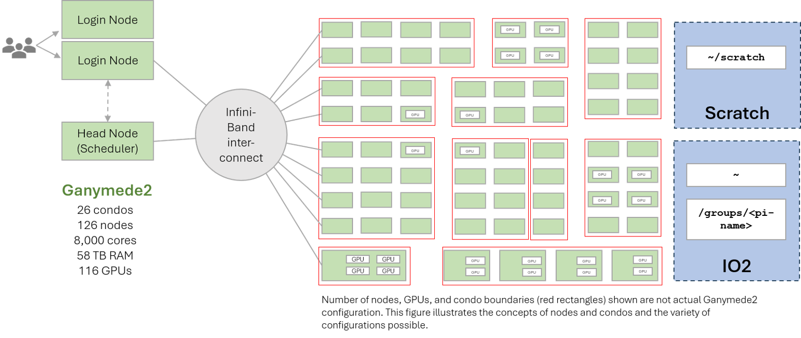
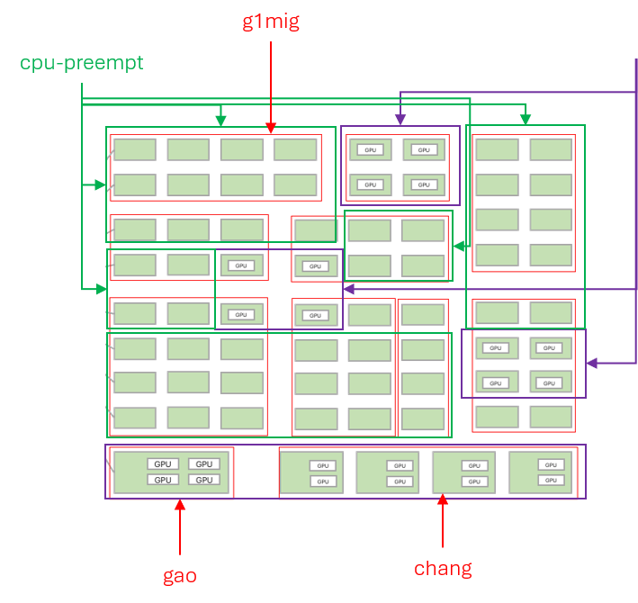

# Hardware Overview



## Cluster Summary

Ganymede 2 is organized into **26 condos** contributed by individual research groups, plus shared partitions accessible to all users.

| Resource | Quantity |
|----------|----------|
| Condos | 26 |
| Total nodes | 126 |
| Total cores | ~8,000 |
| Total RAM | 58 TB |
| Total GPUs | 116 |

All compute nodes are interconnected via **HDR100 InfiniBand** for low-latency, high-bandwidth MPI communication. Nodes also have 10/25 Gbps Ethernet.

## Node Types

### Login Nodes

Login nodes are your entry point to G2. After SSH login, you land here:

- Hostnames: `g2-l-01`, `g2-l-02`
- These nodes handle login sessions and job submission
- **Do not run computational work on login nodes**

### Head Node

The head node runs the SLURM scheduler. SLURM commands (`sbatch`, `squeue`, `scancel`) communicate with this node; you do not log in to it directly.

### CPU Compute Nodes

Most condos consist of CPU-only compute nodes. A representative configuration (g1mig condo):

| Property | Value |
|----------|-------|
| Quantity | 8 nodes |
| CPUs per node | 2× AMD EPYC 9334 2.7 GHz, 32C/64T |
| Total cores per node | 64 |
| RAM per node | 768 GB (24× 32 GB) |
| Storage | 480 GB SSD |
| Network | HDR100 InfiniBand, 10/25 Gbps Ethernet |
| **Combined (8 nodes)** | **512 cores, 6.1 TB memory** |

### GPU Compute Nodes

Several condos include GPU nodes. Two example configurations:

**Coskunuzer condo — GPU node**

| Property | Value |
|----------|-------|
| CPUs | 2× AMD EPYC 9334 2.7 GHz, 32C/64T |
| RAM | 768 GB |
| GPU | 1× NVIDIA H100 NVL, PCIe, 94 GB VRAM |
| Network | HDR100 InfiniBand, 10/25 Gbps Ethernet |

**Rotea condo — GPU node**

| Property | Value |
|----------|-------|
| CPUs | 2× AMD EPYC 9334 2.7 GHz, 32C/64T |
| RAM | 512 GB |
| GPU | 1× NVIDIA H100 NVL, PCIe, 94 GB VRAM |
| Network | HDR100 InfiniBand, 10/25 Gbps Ethernet |

## Understanding CPUs, Cores, and Processors

The word "CPU" can mean different things depending on context:

| Term | Hardware meaning | Software meaning |
|------|-----------------|-----------------|
| **CPU** | The physical chip that installs in a motherboard socket | Same as "core" or "processor" |
| **Core** | An independent processing unit within a CPU chip | A processor capable of running a program |
| **Socket** | The motherboard slot that holds one CPU chip | — |

G2 compute nodes have **2 sockets**, each populated with one AMD EPYC CPU. Each CPU contains 32 or 48 physical cores, giving each node 64 or 96 total cores.

GPU nodes add one or more NVIDIA GPUs. Each GPU has thousands of small CUDA cores and its own dedicated memory (VRAM), distinct from the node's main RAM.

## SLURM Partitions



The cluster's hardware is exposed to jobs through SLURM **partitions**. Every user can submit to the shared `cpu-preempt` and `gpu-preempt` partitions (all CPU/GPU nodes, preemptible), plus any condo partition they belong to.

For the partition table, time limits, and preemption rules, see the [SLURM Job Scheduler](../running-programs/slurm.md) page. To inspect current partitions and their exact resources:

```bash
sinfo
scontrol show partition <partition-name>
```

## GPU Resources in gpu-preempt

The `gpu-preempt` partition provides access to a wide variety of GPU hardware contributed by multiple condos, including:

- NVIDIA GeForce RTX 3090 (76 units)
- NVIDIA H100 NVL (5 units)
- NVIDIA A100 80 GB PCIe (2 units)
- NVIDIA A100 SXM4 80 GB (8 units)
- NVIDIA A30 (3 units)
- NVIDIA V100 PCIe 16 GB (6 units)
- NVIDIA P100 PCIe 16 GB (1 unit)
- NVIDIA RTX Pro 6000 (4 units)
- And more — run `scontrol show partition gpu-preempt` for the full list

## Storage Systems

G2 provides Home, Group, and high-speed Scratch storage tiers. For paths, quotas, backup policy, and data-transfer methods, see [Storage and Data Transfer](storage.md).

## Next Steps

- [See SLURM partitions and job submission →](../running-programs/slurm.md)
- [Storage and data management →](storage.md)
- [Request an account →](account-request.md)

## Need Help?

- **Email**: [circ-assist@utdallas.edu](mailto:circ-assist@utdallas.edu)
- **HPC Services**: [hpc.utdallas.edu/services](https://hpc.utdallas.edu/services)
